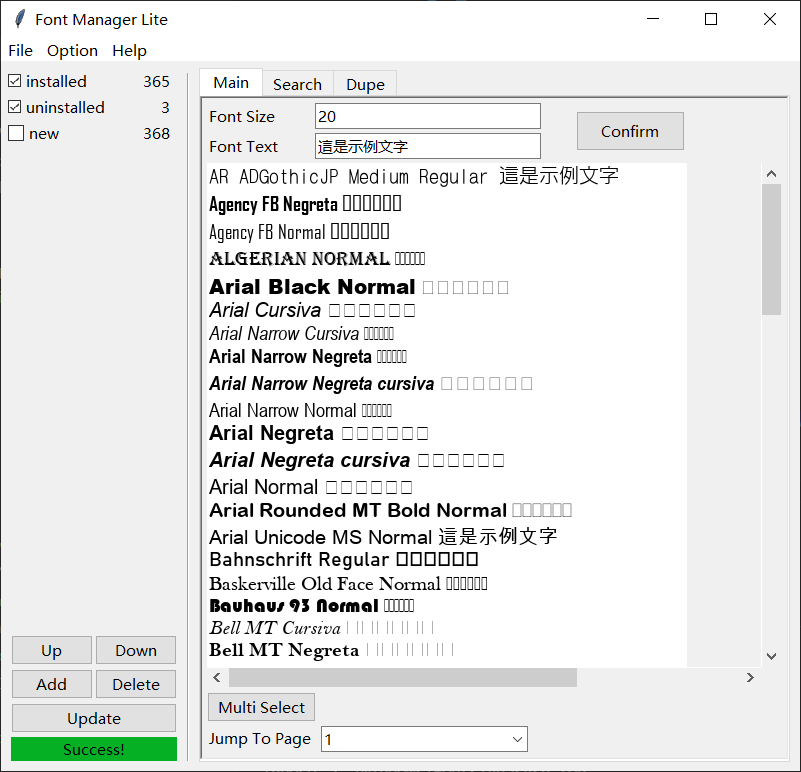

# Font-Manager_Lite
## 一个对中文字体友好的字体管理器
---

## 目前支持的字体格式：ttf, otf, ttc  
可能存在少量字体判断错误

---
## 使用自定义标签管理你的字体
installed, uninstalled, new 为程序保留标签不可删除

---
## 程序窗口始终置顶显示

---
### TO DO: 字体的安装与卸载

---
### PS: 鉴于Python堪忧的执行效率，建议有能力的同学使用源码解释运行，可执行档的速度较慢

## 程序截图送上  

